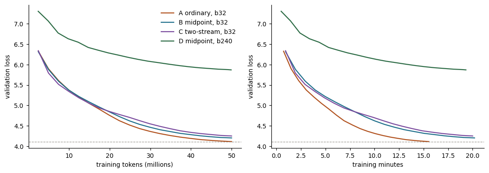
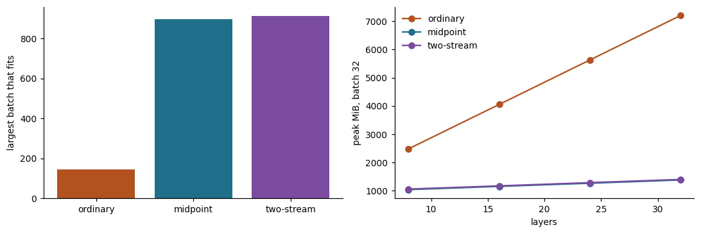
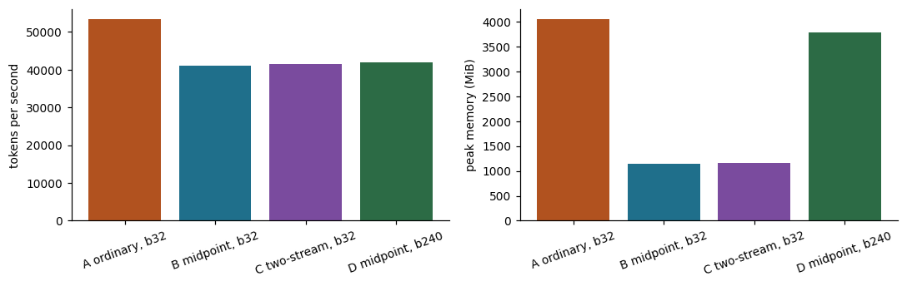
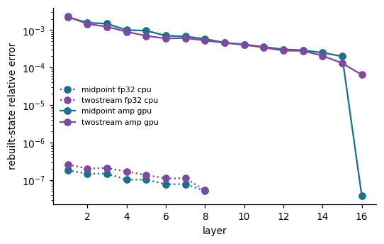

# A 20M model, with and without reversibility

**ERA V5 · Session 13 — Distributed Training II: Model and Pipeline Parallel**

> *Train a 20M LLM for 50M tokens on Google Colab. Fix a batch size you can run. Train again with
> reversibility (report which variant worked for you: mid-point, euler, etc). Train again with
> reversibility, but push it to the maximum batch size. Report final loss, speed (tokens/s),
> memory peak and other findings.*

Run on a Colab **Tesla T4**. Acceptance checks: **12/12 passed**. Every number below is generated from [`outputs/summary.json`](outputs/summary.json) by [`tools/make_readme.py`](tools/make_readme.py); none is typed by hand.

## Reports

Each report is published as a web page, and a standalone copy is in `docs/` to open from disk.

| report | what it covers | published | local copy |
|---|---|---|---|
| **Results report: The Reversible Stack** | the headline numbers, the full loop from web pages to results in diagrams, this write-up, and every notebook cell with its output | [open](https://claude.ai/artifact/9rvTQZyFWKezFH95jsJUHN) | [`docs/session13_walkthrough.html`](docs/session13_walkthrough.html) |
| **Session report: Model and Pipeline Parallel** | the lesson and transcript in plain English: tensor, sequence, pipeline and context parallelism with worked examples, a glossary, and the approach to this assignment | [open](https://claude.ai/artifact/Xyx5GcMBENHgbtCDuKTREg) | [`docs/session13_report.html`](docs/session13_report.html) |
| **Build plan and decisions** | every decision behind the experiment with its reasons, and the build log | [open](https://claude.ai/artifact/NmnX96FbM59KJnhU6FfFzf) | [`docs/assignment_plan.html`](docs/assignment_plan.html) |

## The answer in one table

Same model, same 50M tokens in the same order, same starting weights. Only the way the layers are stacked, and in run D the batch size, changes.

| run | model | batch | steps | final train loss | final val loss | tokens / s | peak memory | cost |
|---|---|---|---|---|---|---|---|---|
| **A** | ordinary (baseline) | 32 | 3,051 | 4.2021 | **4.1145** | 53,446 | 4,051 MiB | $0.09 |
| **B** | reversible, midpoint (h = 0.25, plain start) | 32 | 3,051 | 4.2875 | **4.2042** | 41,109 | 1,144 MiB | $0.12 |
| **C** | reversible, two-stream (h = 1.0) | 32 | 3,051 | 4.3245 | **4.2515** | 41,499 | 1,165 MiB | $0.12 |
| **D** | reversible, midpoint, large batch | 240 | 406 | 5.8336 | **5.8695** | 41,975 | 3,774 MiB | $0.11 |

Loss is the average cross-entropy per token, in *nats*: lower is better, and a gap of 0.1 nats is a visible difference at this size. *h* is the step size in the reversible update rule.

Cost is training time × $0.35 per hour, a public on-demand T4 price; the Colab free tier itself charges nothing. Validation loss is measured on 327,680 held-out tokens from documents never trained on.

## What the brief asked, answered

**1 · Baseline at a batch you can run (run A).** Batch 32, 3,051 steps, final validation loss **4.1145**, 53,446 tokens/s, peak memory 4,051 MiB.

**2 · Reversible, and which variant worked (runs B and C).** **Midpoint worked better.** Run B (midpoint) finished at 4.2042 against run C (two-stream) at 4.2515, 0.0472 nats lower. Both ran at batch 32, like run A. Midpoint's step size h = 0.25 came from a short sweep (h = 1.0 was only 0.0007 nats behind, a near-tie); two-stream's was h = 1.0. Midpoint used the **plain start**: in a side check the plain start beat the Euler start by 0.1381 nats, more than the 0.02 set in advance as the threshold for switching away from Lightning LM's setting.

**3 · Reversible at the maximum batch (run D).** The memory probe found the largest batch that fits: **144** for the ordinary model, **896** for midpoint (6.22×) and **912** for two-stream (6.33×). Training at that size would leave only a few dozen steps for 50M tokens, so run D was capped at **batch 240** (step limit, 406 steps) with the learning rate raised to 2.74e-03 (× √(240/32)). It finished at **5.8695**.

## Findings

**1 · Reversibility cuts memory by about 3.5× at the same batch, and the reversible model's memory barely grows with depth.** At batch 32, midpoint peaked at 1,144 MiB and two-stream at 1,165 MiB, against 4,051 MiB for the ordinary model (0.28× and 0.29×). The probe below measured one training step at 8, 16, 24, 32 layers: each extra layer costs the ordinary model **197.1 MiB** (its stored activations) and the reversible models **14.3 MiB** (only that layer's weights and optimizer state). At 32 layers that is 7,206 MiB against 1,374 MiB.

| layers | ordinary | midpoint | two-stream |
|---|---|---|---|
| 8 | 2,475 MiB | 1,031 MiB | 1,051 MiB |
| 16 | 4,051 MiB | 1,146 MiB | 1,164 MiB |
| 24 | 5,629 MiB | 1,259 MiB | 1,280 MiB |
| 32 | 7,206 MiB | 1,374 MiB | 1,393 MiB |

**2 · The price is speed: 22%–23% fewer tokens per second.** Midpoint ran 23% slower and two-stream 22% slower than run A, less than the 30–50% the paper estimates. Each layer runs twice, once going forward and once again in the backward pass to rebuild its input.

**3 · On this model the reversible runs trained slightly worse.** At the same 50M tokens, midpoint finished 0.0898 nats behind run A and two-stream 0.1370 nats behind run A. None of the reversible runs reached run A's final loss within the 50M-token budget. Each run was trained once, with one seed, so the run-to-run noise was not measured; these gaps are an observation, not a settled result. Three likely causes, not separated here: the reversible rules change the architecture itself (the stream is updated differently from an ordinary residual block), the step size was tuned on only 300 steps, and 16-bit rebuilding adds a small error (finding 5).

**4 · A bigger batch bought no speed on a T4, only fewer steps.** Run D at batch 240 ran at 41,975 tokens/s, 1.02× run B at batch 32. This small model already keeps the GPU busy at batch 32, so 7.5× more sequences per step simply meant 7.5× fewer steps for the same tokens, and a final loss 1.7550 nats above run A. On this hardware, the memory that reversibility frees is worth more spent on a deeper model or longer sequences than on a bigger batch.

**5 · Rebuilding in 16-bit drifts, but the gradients hold.** Measured on the real-size model before training, on the GPU with 16-bit arithmetic: the rebuilt states match the true ones to 3.9e-08 at the top of the stack and drift to 2.2e-03 by the bottom layer (midpoint; two-stream 2.3e-03). Rebuilding by subtraction loses a little accuracy at every layer, and in 16-bit that loss is larger and adds up on the way down. The gradients still agree with plain PyTorch to a cosine of 0.99995 (midpoint) and 0.99996 (two-stream).

**6 · Midpoint's starting state mattered more than its step size.** Over 300 steps the plain start beat the Euler start by 0.1381 nats, while midpoint's best two step sizes were 0.0007 apart.

**7 · Two measurement traps, caught by the smoke run and fixed before the full run.**

- *The Euler start was stored, not rebuilt.* In the smoke run midpoint fitted a largest batch of 664 against two-stream's 912, and used a constant extra amount of memory at every depth: one stored layer. The single ordinary step that makes midpoint's second starting state ran outside the reversible stack. It is now recomputed in the backward pass, and midpoint's largest batch rose to 896.
- *A one-step probe misses Adam's state.* In the smoke run each extra reversible layer cost exactly 4.7 MiB, which is that layer's weights alone: Adam creates its running averages after the first step's memory peak. The probe now measures the second step, and the per-layer figure became 14.3 MiB.

## How the reversible stack saves memory

An ordinary block adds its output to the stream: `x_next = x + f(x)`. You cannot undo that without knowing `x`, so PyTorch stores every layer's working numbers for the backward pass. That stored pile is the activation memory.

A reversible rule can be run backwards:

| stack | forward | backward (rebuild) |
|---|---|---|
| midpoint | `next = previous + 2h · f(current)` | `previous = next − 2h · f(current)` |
| two-stream | `q = q + h·Attn(p)`, then `p = p + h·MLP(q)` | undo the second update, then the first |

The rule alone saves nothing, because PyTorch would still store everything. The saving comes from a custom backward pass (`MidpointStack`, `TwoStreamStack` in Cell 6): the forward pass stores nothing but the two states at the top; the backward pass walks down, rebuilds each layer's input, runs that one layer again to get its gradients, and discards it. Only one layer's working numbers exist at any moment.

Three gates check this before any training, and stop the notebook if they fail:

- **Gate A:** gradients from the custom backward pass equal plain PyTorch's, in double precision: largest relative difference 1.8e-16 across the three stacks.
- **Gate B:** a planted bug (dropout switched on) must be caught: the gradients differed by at least 4%. This is why dropout is 0 in every run: a rebuild cannot replay a random mask.
- **Gate C:** rebuilt states stay close to the true ones (fp32: 1.8e-07), and under 16-bit arithmetic on the GPU the gradients agree with plain PyTorch (finding 5).

## The setup

| | |
|---|---|
| model | 16 layers × width 320, 5 heads, 22.5M parameters (19.7M in the blocks) |
| tokenizer | 8,192-token byte-pair tokenizer trained on the data (3.73 characters per token) |
| data | FineWeb sample-10BT: 50.5M training tokens, 1M validation tokens from separate documents |
| training | 50M tokens per run, sequence length 512, AdamW (weight decay 0.1), learning rate 0.001 with warm-up and cosine decay, fp16 with loss scaling, dropout 0 |
| loss | computed in slices of 8,192 tokens so the vocabulary scores never all exist at once; used in every run |
| hardware | Colab Tesla T4 (15.6 GB), torch 2.11.0+cu128 |
| full run | 99 minutes end to end ($0.58 at the T4 price), of which the four training runs cost $0.44 |

Why these choices (model size, data, variants, batch sizes, learning rate) is recorded decision by decision in [`assignment_plan.html`](assignment_plan.html).

## Limitations

- **One seed per run.** The run-to-run noise was not measured, so the loss gaps between runs are observations, not settled differences.
- **Step sizes were tuned on 300 steps**, and midpoint's two best values were nearly tied; a longer sweep could change the reversible runs' final loss.
- **Lightning LM's exact integrator is not public.** Midpoint here is the paper's two-state rule; where Lightning LM's blend setting (a = 0.5) enters is not published, so it was not reproduced.
- **Small model, one GPU.** At 22.5M parameters the ordinary model's largest batch is only 144; the benefit of reversibility grows with depth and sequence length, which a larger model would show more strongly.

## Files

| path | what it is |
|---|---|
| `session13_reversible_v4_executed_full.ipynb` | the executed notebook: every cell's output, with each run's progress replayed from its log |
| `session13_reversible.ipynb` | the same notebook, not executed, to run again |
| `notebook_src.py` | the source of truth: a plain script that can be run and debugged locally |
| `outputs/summary.json` | every measured number; this README is generated from it |
| `outputs/RESULTS.md` | the results table as the notebook wrote it |
| `outputs/logs/` | the full history of every training run |
| `outputs/*.png` | the four figures above |
| `session13_walkthrough.html` | the results report: headline numbers, the full loop in diagrams, this write-up, and every cell with its output |
| `assignment_plan.html` | the decisions behind the experiment and the build log |
| `docs/` | standalone copies to open from disk: `session13_walkthrough.html` (results report), `session13_report.html` (session report: lesson and transcript analysis), `assignment_plan.html` |
| `tools/` | `py2ipynb.py` builds the notebook from the script; `make_readme.py` writes this README; `make_walkthrough.py` (with `loop_section.py`) builds the results report; `export_docs.py` refreshes `docs/` |

## How to run it

Open `session13_reversible.ipynb` in Colab on a **T4 GPU** and run all. `MODE = "full"` in Cell 1 is the experiment (about 1 hour 40 minutes); `MODE = "smoke"` is a 30-minute check of every GPU code path. Results are cached on Google Drive under `MyDrive/era5_session13/`, so after a disconnect, running all again reloads finished work and resumes an interrupted run from its checkpoint. On a machine without a GPU the notebook switches itself to a tiny test profile and never touches the real results.

## Acceptance checks

- [x] A. midpoint (Euler start) gradients == plain autograd, fp64
- [x] A. midpoint (plain start) gradients == plain autograd, fp64
- [x] A. two-stream gradients == plain autograd, fp64
- [x] B. planted dropout bug caught, both stacks
- [x] C. rebuilt states within threshold, fp32
- [x] C. gradient cosine vs autograd under fp16 autocast
- [x] data: 50M-token budget fits the tokenised file
- [x] runs: every run finished its step budget
- [x] runs: every run's validation loss fell
- [x] probe: reversible largest batch > ordinary
- [x] probe: reversible memory grows less per layer than ordinary
- [x] run D: batch larger than 32

